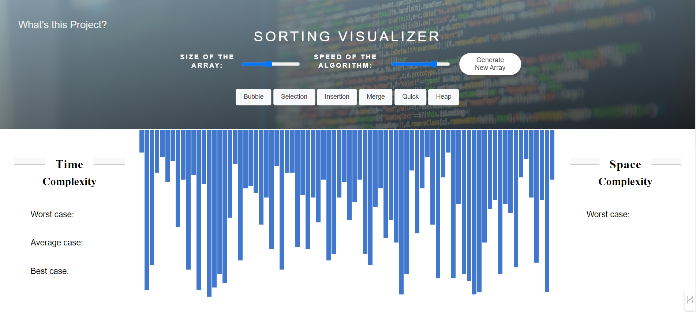
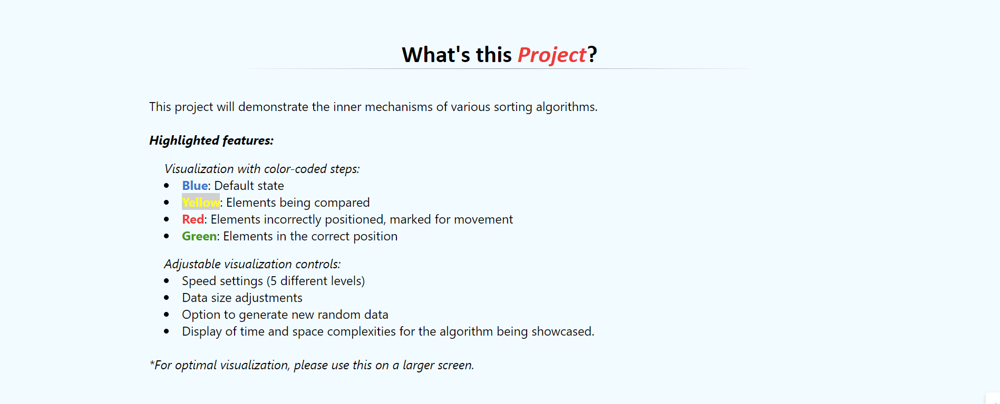

# Sorting Visualizer

This project is a Sorting Visualizer implemented using HTML, CSS, and JavaScript. It provides an intuitive real-time sorting visualization, showcasing six distinct sorting algorithms. Users can choose from four different color schemes and adjust sorting speeds to enhance their understanding of sorting algorithms and concepts.

## Screenshot

## Features

- Real-time sorting visualization.
- Four distinct color schemes.
- Five varying sorting speeds.

## Six sorting algorithms: 
- Bubble Sort,
- Insertion Sort, 
- Selection Sort, 
- Heap Sort, 
- Merge Sort, and 
- Quick Sort.

## How to Use:
- Choose a sorting algorithm from the dropdown menu.
- Adjust the color scheme and sorting speed as desired.
- Click the "Visualize" button to see the sorting algorithm in action.
  [Click here to visualize](https://rehan2205.github.io/sortingVisualizer/)

"# sortingVisualizer" 
